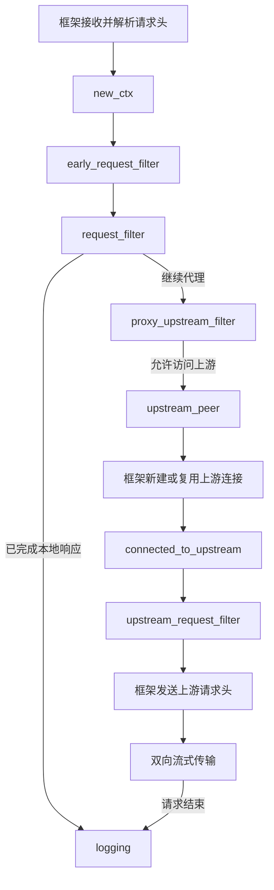

# Pingora 请求生命周期与阶段串联

关联：[原始需求](00-original-requirements.md)、[架构设计](01-architecture.md)、[三个明确入口的联调验收](05-explicit-routes-validation.md)。

本文依据项目锁定的 Pingora 0.9 API，说明当前无缓存代理的正常路径、双向流式传输和错误路径。业务实现见 [proxy.rs](../crates/llmproxy-gateway/src/proxy.rs)，框架概览参考 [Pingora 生命周期文档](https://github.com/cloudflare/pingora/blob/main/docs/user_guide/phase.md)。

## 谁负责串联阶段

`http_proxy_service` 将实现了 `ProxyHttp` 的 `Gateway` 接入 Pingora。框架在处理 HTTP 请求的不同时间点调用对应钩子；业务代码通过返回值决定继续、短路或进入错误处理，无须自行调用下一个阶段。

未重写的钩子使用框架默认实现。例如当前请求体和响应体过滤器保持默认行为，由 Pingora 完成流式转发。

| 对象 | 生命周期与作用 | 当前项目例子 |
|---|---|---|
| `Gateway` | 服务级业务对象，可被多个请求并发使用 | 持有已解析配置及指标句柄 |
| `Session` | 当前请求的代理会话，管理下游 HTTP 状态并提供读写能力 | 读取请求路径、发送本地响应、查询已写出的响应头 |
| `CTX` / `RequestContext` | 每个请求独立的业务状态，随调用传给各阶段 | 保存协议、开始时间和 span |
| `HttpPeer` | 描述上游地址与连接参数，连接本身由框架建立或复用 | Provider 地址、端口、TLS/SNI、连接和读写超时 |

例如，`request_filter` 将协议写入 `ctx.protocol`，后续 `upstream_peer` 和 `upstream_request_filter` 读取同一字段，分别选择连接目标和 Provider 凭据。同一 HTTP keep-alive 连接上的后续请求仍会创建新的请求上下文。

配置解析、环境变量凭据读取和 OTLP exporter 初始化属于启动逻辑，位于上述逐请求流程之前。

## 正常代理路径

框架先接收并解析请求头，成功后才进入 `ProxyHttp` 的请求生命周期。



图中省略缓存及可选模块。当前项目默认允许访问上游；`proxy_upstream_filter` 的拒绝语义见后面的返回值表。

| 阶段 | 触发时机 | 作用 | 当前项目行为 |
|---|---|---|---|
| `new_ctx` | 请求头解析成功后 | 创建本次请求的上下文 | 初始化计时器及协议、span 字段 |
| `early_request_filter` | 下游模块执行前 | 早期模块配置或追踪初始化 | 使用默认实现；鉴权、限流等入口逻辑应优先放入 `request_filter` |
| `request_filter` | 请求入口检查时 | 校验请求、选择路由、生成本地响应 | 匹配三种协议、创建 span，处理 404/405/501 |
| `proxy_upstream_filter` | 准备访问上游前 | 决定是否继续访问上游 | 默认允许 |
| `upstream_peer` | 需要取得上游连接时 | 返回目标及连接策略；如框架允许重试，每次尝试可以重新调用 | 解析 Provider 地址，设置 TLS/SNI 和超时 |
| `connected_to_upstream` | 新建或复用连接成功后 | 记录连接信息、是否复用等 | 使用默认实现；调用此钩子不代表一定发生了新握手 |
| `upstream_request_filter` | 上游请求头发送前 | 修改发给 Provider 的请求头副本 | 改写 Host、凭据与配置控制的协议头 |
| `request_body_filter` | 请求体块准备转发时 | 按块检查或修改请求体 | 原样通过 |
| `upstream_response_filter` | 收到上游响应头后 | 处理来自 Provider 的响应头 | 清理逐跳头，保留状态和端到端响应头 |
| `response_filter` | 代理响应头发给客户端前 | 处理最终下游响应头 | 使用默认实现 |
| `upstream_response_body_filter` | 收到上游响应体块时 | 检查或修改上游数据块 | 原样通过 |
| `response_body_filter` | 响应体块发给客户端前 | 处理最终下游数据块 | 原样通过 |
| `logging` | 请求完成或最终失败时 | 汇总本次请求的状态、耗时、错误及指标 | 输出当前完成日志，更新请求数、失败数和耗时 |

`upstream_response_*` 关注从上游收到的数据，`response_*` 关注发给下游的数据。缓存或模块启用后，两者之间可以存在进一步处理。直接生成的本地响应不保证经过这些业务响应过滤器，因此公共响应头也需要在本地响应函数中设置。

## 返回值如何影响流程

两个布尔钩子的语义不同：

| 钩子 | `Ok(true)` | `Ok(false)` |
|---|---|---|
| `request_filter` | 已经自行响应，结束代理流程并进入 `logging` | 继续后续处理 |
| `proxy_upstream_filter` | 允许访问上游 | 拒绝访问上游；没有自行写出响应时，框架返回 502 |

`request_filter` 返回 `Ok(true)` 前必须完成本地响应；返回值本身不会生成响应。当前未知路径的处理是先调用 `respond_error(404)`，再返回 `Ok(true)`。

返回 `Result<()>` 的过滤器通常以 `Ok(())` 表示继续；返回 `Err` 时由框架进入对应的故障处理路径。`upstream_peer` 成功返回的是描述上游的 `HttpPeer`，并不在钩子内完成 TCP/TLS 连接。

## 请求体与响应体如何流动

发送上游请求头后进入双向流式处理，上传请求体与读取上游响应可以交错执行。上游可以在客户端尚未上传完整请求体时提前返回，例如拒绝一个请求。

```text
请求方向：
客户端请求体块 → request_body_filter → 上游

响应方向：
上游响应头 → upstream_response_filter → response_filter → 客户端
上游响应体块 → upstream_response_body_filter → response_body_filter → 客户端
```

body 过滤器按数据块调用，不保证一次收到完整请求体或响应体。一个数据块可能只包含半个 SSE 事件，也可能包含多个事件；网络分块边界不等于协议事件边界。

当前明确入口保持字节内容与顺序，使用 Pingora 自带的流式转发。SSE 在正常结束或中断后才执行最终 `logging`，不会在发送响应头时就记录最终访问结果。

## 错误路径与重试

| 出错位置 | 调用路径 | 当前项目处理 |
|---|---|---|
| `request_filter` 等前置钩子返回错误 | `fail_to_proxy → logging` | 根据错误生成本地故障响应并记录 |
| `upstream_peer` 返回错误，例如 DNS 解析失败 | `fail_to_proxy → logging` | 进入上游故障映射；此时还未调用连接器 |
| 连接器建立上游连接失败 | `fail_to_connect → fail_to_proxy → logging` | 禁止重试；连接拒绝等返回 502，超时返回 504 |
| 取得连接后的转发故障 | `error_while_proxy → fail_to_proxy → logging` | 禁止重试，并区分响应是否已经开始 |
| Provider 正常返回 400、429、500 等状态 | 正常响应头、响应体路径 | 保留业务错误状态、响应体和端到端头 |

Pingora 允许 `fail_to_connect` 或 `error_while_proxy` 返回可重试错误，经框架判断后回到 `upstream_peer`；这种重试不会重新执行最前面的路由过滤。当前项目在这两个钩子中明确关闭自动重试，避免重复生成或计费。

`fail_to_proxy` 分两种情况处理：

- 尚未发送最终响应头：根据故障类型生成 502/504 等响应。
- 已经发送最终响应头：结束失败流，保持已经发送的状态，不能再追加第二个 HTTP 响应、错误 JSON 或伪造的 SSE 完成事件。

例如，上游先返回 200 并发送部分 SSE 数据，然后读取超时，客户端已经收到的状态仍是 200；最终日志会同时记录该状态和超时故障。各类超时的具体含义及写入超时后的等待行为，见[超时契约](05-explicit-routes-validation.md#超时契约)。

## 日志与生命周期的边界

`logging` 覆盖进入业务代理流程的本地拒绝、正常完成和最终失败。请求头解析阶段就被框架拒绝的连接尚未进入这些业务钩子，不会调用业务 `logging`。

请求结束后，框架还会清理资源并决定是否复用连接。`logging` 是请求收尾的观测点，不代表客户端应用已经确认消费了全部响应字节。

完整访问日志字段与输出策略见[访问日志设计](04-access-logging.md)；各项能力的完成状态见[实施任务](02-tasks.md)。
