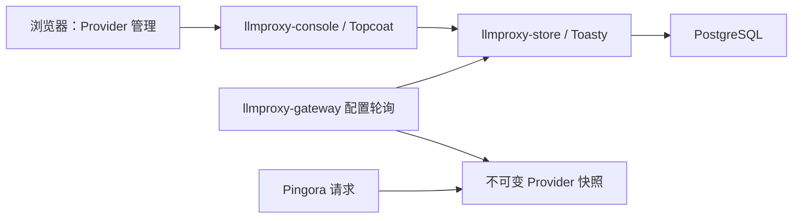

# Provider 管理控制台与 PostgreSQL

关联：[原始需求](00-original-requirements.md)、[架构设计](01-architecture.md)、[任务列表](02-tasks.md)、[本地运行](03-development.md)。

## 本轮需求

- 使用 Topcoat 实现 Ant Design 风格的简洁中文后台，通过 UI 管理 Provider。
- 复用 `topcoat-ant-design`；缺失的通用组件可在组件库中添加，再由控制台引用。
- 使用 Toasty ORM 和 PostgreSQL 持久化。开发与测试分别使用 `llmproxy_dev`、`llmproxy_test`。
- 本地数据库连接信息和主密钥放在忽略提交的 `.env`；仓库提供 `.env.example`。

## 分层与数据流



| 模块 | 职责 |
|---|---|
| `llmproxy-core` | 协议和基础配置校验，保持独立于 UI、数据库和代理框架 |
| `llmproxy-store` | Toasty 模型、SQL 迁移、Provider CRUD、协议绑定、凭据加解密、版本检查 |
| `llmproxy-console` | Topcoat SSR 页面、表单处理、搜索筛选、操作反馈，复用 Ant Design 组件 |
| `llmproxy-gateway` | 加载已启用且被选中的 Provider，原子替换配置快照，继续承担流式代理 |

控制台与网关分进程运行，网关请求路径不访问数据库。数据库配置变化通过周期性轮询加载，默认约一秒对后续请求生效。每个请求固定使用开始时选定的 Provider，正在进行的 SSE 不随配置更新切换目标或凭据。

未配置 `LLMPROXY_DATABASE_URL` 时，网关继续使用原 TOML 模式。数据库模式下，未选择当前 Provider 的协议入口返回 503；自动入口的协议识别任务独立推进。

## Provider 与协议绑定

一个 Provider 记录对应一种协议配置，同一种协议可以创建多个 Provider。通过“设为当前服务”选择该协议实际使用的上游；“已启用”表示可被选择，“当前使用”表示已绑定到入口。例如 OpenAI Chat 的当前服务接收 `/v1/chat/completions` 的新请求。

Provider 管理包含名称、协议、上游地址、API Key、Anthropic 版本和三项超时。请求路径保持协议约定，不允许客户端指定任意上游。

- 新增后可选择设为当前；没有绑定的入口保持 503。
- 停用当前 Provider 时，同一事务解除绑定。
- 仅已停用的 Provider 显示删除操作；服务端同样拒绝删除已启用的 Provider，须先停用。
- 当前 Provider 修改协议前须先解除当前绑定。
- 表单携带记录版本，陈旧编辑返回冲突提示，避免覆盖其他修改。

所有写操作经过服务端校验。数据库迁移提交到版本库并记录已执行版本，不使用清空数据库或 `reset_db()` 初始化。

## 表单交互

- 新建、编辑在列表上方打开模态对话框，复用组件库 Dialog；打开时保留当前列表和筛选，支持关闭按钮、取消和 Escape。
- 连接信息只需填写一个“上游地址”，例如 `https://api.deepseek.com` 或 `http://127.0.0.1:11434`。自动识别 HTTP/HTTPS 和端口，未指定端口时分别使用 80/443，允许末尾 `/`；列表与编辑表单省略默认端口。
- 上游地址填写服务根地址，请求路径由所选协议决定；不接受自定义路径、查询参数、片段或 URL 内嵌凭据。当前支持域名和 IPv4。服务端解析后沿用数据库的 `host / port / tls` 字段，已有 Provider 无需迁移即可编辑。
- 只有选择 Anthropic Messages 时显示并提交 Anthropic API 版本；其他协议在服务端忽略该字段。
- 超时设置默认折叠，摘要展示当前连接、读取、写入毫秒数。校验失败时展开，保证错误字段能够获得焦点。
- 保存期间防止重复提交，成功后关闭弹窗并刷新列表；失败保留已填写内容并清空 API Key。
- 列表中的停用与删除均使用确认气泡，显示具体 Provider 名称、协议、上游地址和操作影响；停用当前服务时明确说明对应入口的新请求将暂时不可用。取消和确认按钮使用相同尺寸。

交互采用 Topcoat 原生 `Signal`、`@click / @input / @change / @invalid` 和 `:value / :hidden / :disabled` 绑定。页面只渲染一个 Dialog，列表中的非敏感 Provider 配置用于初始化编辑状态；保存通过标准 POST 提交给 Topcoat `Form`，由服务端校验并返回错误页或 303 跳转。控制台没有独立手写业务 JavaScript、`fetch` 或 DOM 替换逻辑。

`topcoat-ant-design` 的 Dialog 已补充可选 `open` 与 `title` Signal。浏览器原生 `showModal / close` 的必要适配封装在组件库内，业务只管理 Rust 状态。Topcoat 会把运行时表达式编译成浏览器 JavaScript，仍须加载框架自己的 runtime 资源。

## 凭据与控制台边界

API Key 由 UI 输入，使用带认证的加密保存到数据库，主密钥从 `LLMPROXY_MASTER_KEY` 注入。主密钥为 Base64 编码的 32 个随机字节，两项服务使用同一值；重启时保持一致。

首次迁移使用加密校验记录将数据库绑定到主密钥，后续读写和网关加载都会校验；主密钥错误时拒绝操作，避免不同服务写入彼此无法解密的凭据。请备份主密钥，当前尚未实现主密钥轮换。

列表和编辑页面只显示密钥是否已配置，不向浏览器返回明文或密文。新建必须填写密钥，编辑留空保留已有密钥；校验失败时也不回显密钥。

本轮控制台面向本机开发，默认监听 `127.0.0.1:3200`，校验 Host 并为写操作验证 CSRF token。多用户登录、权限和审计是后续管理能力，不能将当前开发控制台直接暴露到公共网络。

## 启动

组件库当前使用本地路径依赖 `../topcoat-ant-design`，依赖其中的中文标签以及本轮新增的受控 Dialog 支持。本机已经存在该目录；其他环境需要准备包含这些改动的组件库 checkout，已发布的同版本 crates.io 包尚不包含这些 API。组件库地址见 [topcoat-ant-design](https://github.com/mosenet-labs/topcoat-ant-design)。

本机开发库和测试库已创建，`.env` 已准备。首次在其他环境启动时：

1. 在 PostgreSQL 创建 `llmproxy_dev` 和 `llmproxy_test` 两个数据库。
2. 复制 `.env.example` 为 `.env`，填写本机数据库 URL；测试库 URL 必须指向测试数据库。
3. 按示例生成一次 `LLMPROXY_MASTER_KEY`，保存到 `.env`。控制台和网关使用相同值，之后不要重新生成覆盖。

然后运行：

```sh
# 编译、执行数据库迁移，并同时启动控制台和网关
bash scripts/dev.sh up

# 或分别启动
bash scripts/dev.sh migrate
bash scripts/dev.sh console
bash scripts/dev.sh gateway
```

控制台地址：`http://127.0.0.1:3200`（`/providers` 会跳转到首页）。网关默认地址：`http://127.0.0.1:8080`。前台运行脚本时按 Ctrl+C 同时停止两个服务。

本地连接信息不写入原始需求或公开示例。数据库模式无需在进程环境中预先配置三个 Provider 的 API Key，可在空数据库启动后从 UI 新增。

## 验收

- Toasty 在 PostgreSQL 上完成新增、编辑、启停、删除与协议切换，迁移可重复执行且不丢失已有配置。
- 数据库凭据是密文，列表和表单不返回明文；编辑留空保持密钥。
- 旧版本表单触发冲突，激活、停用与删除符合绑定约束。
- UI 支持搜索、筛选、空态、表单反馈与删除确认；无效 CSRF / Host 被拒绝。
- 新配置被网关加载后生效，未绑定协议返回 503，在途请求使用原配置。
- 现有三个入口的 HTTP/SSE 测试继续通过。

## 本轮验证结果

- `cargo test --workspace --offline` 在启用 PostgreSQL 测试配置后通过全部 27 项测试；`cargo check --workspace --offline`、`cargo fmt --all --check` 和 `git diff --check` 均通过。
- Toasty/PostgreSQL 生命周期测试通过：迁移可重复执行、三协议绑定、并发版本冲突、切换/停用/删除约束、密钥留空保留与轮换、密文存储、错误主密钥拒绝，以及旧数据升级校验。
- 控制台真实 HTTP 测试通过：三个协议的 CRUD、查询筛选、Host/Origin/CSRF 拒绝、表单错误不泄露凭据、静态资源与版本冲突。
- 网关数据库集成测试通过：空配置 503、激活/切换/密钥更新生效、旧 SSE 不被打断、禁用解绑；用独立测试 schema 内的行锁触发刷新超时，验证保留旧快照和恢复。
- 浏览器检查：首页空态、列表、编辑页和中文删除确认；通过 UI 新建并激活模拟上游后，实际网关请求返回 200，Host 和凭据改写均正确。临时 Provider 已清理。

数据库自动化测试通过 `LLMPROXY_TEST_DATABASE_URL` 启用，每次创建独立 schema 并清理。普通 `cargo test --workspace` 若未设置该变量，会跳过数据库相关场景；完整验证应先加载本地 `.env`。

弹窗调整追加验证：控制台真实 HTTP 回归通过；浏览器验证新建/编辑保存、按协议显示版本字段、连接项对齐、超时默认折叠、无效超时展开聚焦和错误表单保持弹窗。

Topcoat 原生交互替换后，控制台 HTTP 回归再次通过；浏览器验证创建/编辑提交、服务端校验失败重新打开模态框、Escape 关闭、从编辑切换新建时重置字段，以及原生 `invalid` 事件展开超时字段。组件库 13 项组件测试通过。
