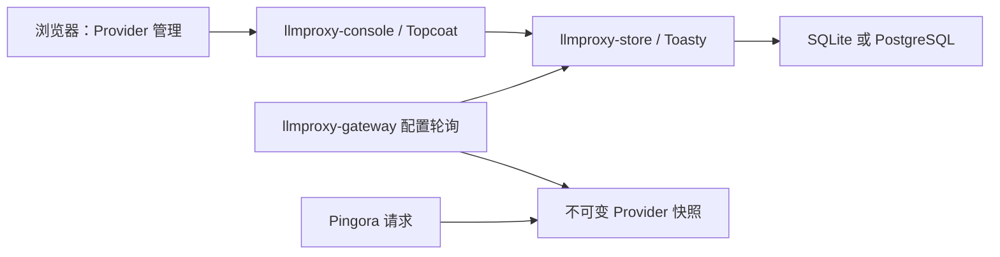

# Provider 管理控制台与数据库

关联：[原始需求](00-original-requirements.md)、[架构设计](01-architecture.md)、[任务列表](02-tasks.md)、[本地运行](03-development.md)。

## 本轮需求

- 使用 Topcoat 实现 Ant Design 风格的简洁中文后台，通过 UI 管理 Provider。
- 复用 `topcoat-ant-design`；缺失的通用组件可在组件库中添加，再由控制台引用。
- 使用 Toasty ORM 持久化；原始需求指定 PostgreSQL，现已补充默认 SQLite 兼容。开发与测试的 PostgreSQL 库可分别使用 `llmproxy_dev`、`llmproxy_test`。
- 本地数据库连接信息和主密钥放在忽略提交的 `.env`；仓库提供 `.env.example`。

## 分层与数据流



| 模块 | 职责 |
|---|---|
| `llmproxy-core` | 协议和基础配置校验，保持独立于 UI、数据库和代理框架 |
| `llmproxy-store` | Toasty 模型、SQL 迁移、Provider CRUD、协议绑定、凭据加解密、版本检查 |
| `llmproxy-console` | Topcoat SSR 页面、表单处理、搜索筛选、操作反馈，复用 Ant Design 组件 |
| `llmproxy-gateway` | 加载已启用且被选中的 Provider，原子替换配置快照，继续承担流式代理 |

控制台与网关同进程、同端口运行（见[统一服务设计](11-unified-service.md)），网关请求路径不访问数据库。数据库配置变化通过周期性轮询加载，默认约一秒对后续请求生效。每个请求固定使用开始时选定的 Provider，正在进行的 SSE 不随配置更新切换目标或凭据。

未配置 `LLMPROXY_DATABASE_URL` 时，统一服务使用本地持久化 SQLite；未选择当前 Provider 的协议入口返回 503。自动入口的协议识别任务独立推进。

## Provider 与协议绑定

一个 Provider 可配置一个或多个协议，每种协议有独立的上游转发路径。同一种协议可以创建多个 Provider；通过该协议的“设为当前”选择实际使用的上游。“已启用”表示可被选择，“当前使用”按协议显示。例如 OpenAI Chat 的当前服务接收下游 `/v1/chat/completions`，再转发到 Provider 配置的 Chat 路径。完整行为见[多协议 Provider 与模型探测](13-provider-interfaces-and-model-discovery.md)。

Provider 管理包含名称、支持的协议及各自上游路径、上游地址、API Key、模型探测路径和协议、Anthropic 版本及三项超时。探测鉴权头由选中的协议确定。下游请求路径保持协议约定，不允许客户端指定任意上游。

- 新增后可选择设为当前；没有绑定的入口保持 503。
- 停用当前 Provider 时，同一事务解除绑定。
- 仅已停用的 Provider 显示删除操作；服务端同样拒绝删除已启用的 Provider，须先停用。
- 当前 Provider 移除某个正在绑定的协议前须先解除绑定；可以编辑该协议的转发路径。
- 表单携带记录版本，陈旧编辑返回冲突提示，避免覆盖其他修改。

所有写操作经过服务端校验。数据库迁移提交到版本库并记录已执行版本，不使用清空数据库或 `reset_db()` 初始化。

## 表单交互

- 控制台字体与 gitlab-reviewer 一致，使用 JetBrains Mono，中文按 Noto Sans SC、PingFang SC、Microsoft YaHei 回退。
- Provider 管理（`/ui`）与路由概览（`/ui/routes`）使用独立页面，导航选中项、标题与面包屑同步；共用内容区宽度和边距。协议路由卡片集中在路由概览，点击卡片返回对应协议的 Provider 列表。
- 新建、编辑在列表上方打开模态对话框，复用组件库 Dialog；打开时保留当前列表和筛选，支持关闭按钮、取消和 Escape。
- 连接信息只需填写一个“上游地址”，例如 `https://api.deepseek.com` 或 `http://127.0.0.1:11434`。自动识别 HTTP/HTTPS 和端口，未指定端口时分别使用 80/443，允许末尾 `/`；列表与编辑表单省略默认端口。
- 上游地址填写服务根地址，不包含接口路径、查询参数、片段或 URL 内嵌凭据。各协议的接口路径在下方独立配置，有默认值并可修改。当前支持域名和 IPv4。服务端解析后沿用数据库的 `host / port / tls` 字段。
- 选择 Anthropic Messages 时，在该协议行显示可编辑的 API 版本，默认 `2023-06-01`。
- 列表名称下方用 `Chat / Responses / Messages` 简称展示支持的协议；模型探测只在新建和编辑表单中操作。
- 模型探测路径默认 `/models`，探测协议从已配置的接口协议中选择；表单可预览探测，保存后持久化灰色/绿色/红色状态，结果包含 Provider 名称。
- 超时设置默认折叠，摘要展示当前连接、读取、写入毫秒数。校验失败时展开，保证错误字段能够获得焦点。
- 保存期间防止重复提交，成功后关闭弹窗并局部更新列表；失败保留已填写内容并清空 API Key。
- 列表中的停用与删除均使用确认气泡，仅显示“确认停用/删除「Provider 名称」？”；取消和确认按钮使用相同尺寸。
- 新建、保存、启用、停用、设为当前服务、删除成功后使用组件库 `notification` 显示包含记录名称的通知，例如“「deepseek」已停用”。列表操作失败也通过通知显示记录名称和失败原因。通知默认约 4.5 秒自动关闭，可手动关闭；表单校验错误保留在弹窗内。

交互采用 Topcoat 原生 `Signal`、`@click / @input / @change / @invalid` 和 `:value / :hidden / :disabled` 绑定。页面只渲染一个 Dialog，列表中的非敏感 Provider 配置用于初始化编辑状态；保存和列表操作通过原生 `#[procedure]` 异步提交，由服务端校验并返回业务结果；成功后更新 `Signal`，由 `#[shard]` 局部重绘列表，notification 显示包含记录名称的本次操作结果。通知不再从 URL 或 Cookie 初始化，因此刷新不会重播。Topcoat 0.8.1 原生表达式不能捕获请求拒绝，提交处用少量 `raw!` 捕获原生 procedure 的异常，恢复提交状态；请求与 DOM 更新仍由框架完成。详见[异步操作方案](09-console-async-actions.md)。

`topcoat-ant-design` 的 Dialog 已补充可选 `open` 与 `title` Signal。浏览器原生 `showModal / close` 的必要适配封装在组件库内，业务只管理 Rust 状态。Topcoat 会把运行时表达式编译成浏览器 JavaScript，仍须加载框架自己的 runtime 资源。

## 样式与构建

视觉尺度参照 GitLab Review：桌面页标题 28px，正文、输入框和操作 14px，辅助信息 13px；次级文字使用 `#595959`，弱提示使用 `#737373`。页面内边距统一为 28px，卡片和弹窗主体为 24px，普通控件高度 36px。窄屏以布局换行适配，正文不再缩小到 10–11px。

Provider 管理和路由概览共用浅色导航、页头和内容区；移除重复的“模型服务”眉题及页脚标语。导航、搜索、新增、路由跳转、空状态和提示使用组件库提供的 Ant Design SVG 图标，由 Topcoat 原生 `icon` 渲染。

- 使用 Topcoat 内置的 `topcoat::tailwind::BuildConfig`，在 Cargo 构建时扫描 `src/**/*.rs`，生成并嵌入控制台 CSS；不需要额外的 npm 构建流程。
- 布局、响应式断点和状态样式写在 Rust `view!` 的 Tailwind 类中，重复的按钮、导航、表单网格样式使用常量配合 `class!` 组合。类名必须完整出现，避免运行时拼接导致 Tailwind 无法识别。
- `crates/llmproxy-console/styles.css` 只保留 Tailwind 入口、Ant Design 风格的主题色和页面基础样式；原手写 `src/console.css` 已移除。保留 JetBrains Mono 字体和中文回退字体。
- Dialog、通知、确认气泡、表格和标签继续复用 `topcoat-ant-design`。控制台与组件库共享 `theme / components / utilities` 层级，控制台样式后加载，确保页面响应式规则生效；不引入 Preflight，保留组件库的控件默认行为。
- `build.rs` 监听 Rust 源码和样式入口变化；修改后重新运行 `cargo run` 即可生成新样式。首次构建可能由 Topcoat 下载 Tailwind CLI，与组件库使用同一套集成。

视觉调整已在 1280px 桌面与 390px 窄屏检查：空状态、Provider 列表、路由卡片、创建弹窗和停用确认气泡正常；窄屏页面无横向溢出，表格保留容器内横向滚动。异步创建和设为当前服务验证通过；`cargo fmt --all -- --check`、`cargo check --workspace --offline`、`cargo test --workspace --offline` 均通过，完整测试 33 项。

## 凭据与控制台边界

API Key 由 UI 输入，使用带认证的加密保存到数据库。主密钥为 Base64 编码的 32 个随机字节；PostgreSQL 从 `LLMPROXY_MASTER_KEY` 注入，SQLite 默认从数据库旁的私有 `.key` 文件读取，也允许显式设置同一环境变量。控制台与代理模块使用同一值；重启时保持一致。

首次迁移使用加密校验记录将数据库绑定到主密钥，后续读写和网关加载都会校验；主密钥错误时拒绝操作，避免不同服务写入彼此无法解密的凭据。请备份主密钥，当前尚未实现主密钥轮换。

列表和编辑页面只显示密钥是否已配置，不向浏览器返回明文或密文。新建必须填写密钥，编辑留空保留已有密钥；校验失败时也不回显密钥。

本轮控制台面向本机开发，通过统一监听地址 `127.0.0.1:3200` 的 `/ui` 访问，校验 Host 并为写操作验证 CSRF token。多用户登录、权限和审计是后续管理能力，不能将当前开发控制台直接暴露到公共网络。

## 启动

组件库当前使用本地路径依赖 `../topcoat-ant-design`，依赖其中的中文标签以及本轮新增的受控 Dialog 支持。本机已经存在该目录；其他环境需要准备包含这些改动的组件库 checkout，已发布的同版本 crates.io 包尚不包含这些 API。组件库地址见 [topcoat-ant-design](https://github.com/mosenet-labs/topcoat-ant-design)。

默认 SQLite 启动时：

1. 准备相邻目录的 `topcoat-ant-design` 组件库。
2. 不设置 `LLMPROXY_DATABASE_URL` 和 `LLMPROXY_MASTER_KEY`，首次启动自动创建 `./data/llmproxy.sqlite3`、密钥文件和 schema。

改用 PostgreSQL 时，在 PostgreSQL 创建开发库，复制 `.env.example` 为 `.env` 并填写数据库 URL 与固定的 `LLMPROXY_MASTER_KEY`；可选填写 `LLMPROXY_TEST_DATABASE_URL` 运行 PostgreSQL 回归。现有 `.env` 中的 PostgreSQL URL 会优先于默认 SQLite。

然后运行：

```sh
# 编译并启动；进程先迁移数据库，再开放控制台和网关
bash scripts/dev.sh up

# 如需单独执行迁移，可使用此命令；正常启动会自动迁移所选数据库
bash scripts/dev.sh migrate
cargo run
```

控制台地址：`http://127.0.0.1:3200/ui`（`/ui/providers` 会跳转到控制台首页）。代理入口共用 `http://127.0.0.1:3200/v1/*`。前台运行时按 Ctrl+C 停止统一服务。

本地连接信息不写入原始需求或公开示例。无需在进程环境中预先配置三个 Provider 的 API Key，可在空数据库启动后从 UI 新增。

## 验收

- Toasty 在 PostgreSQL 上完成新增、编辑、启停、删除与协议切换，迁移可重复执行且不丢失已有配置。
- 数据库凭据是密文，列表和表单不返回明文；编辑留空保持密钥。
- 旧版本表单触发冲突，激活、停用与删除符合绑定约束。
- UI 支持搜索、筛选、空态、表单反馈与删除确认；无效 CSRF / Host 被拒绝。
- 新配置被网关加载后生效，未绑定协议返回 503，在途请求使用原配置。
- 现有三个入口的 HTTP/SSE 测试继续通过。

## 本轮验证结果

- `cargo test --workspace --offline` 在启用 PostgreSQL 测试配置后通过全部 27 项测试；`cargo check --workspace --offline`、`cargo fmt --all --check` 和 `git diff --check` 均通过。
- Toasty/PostgreSQL 生命周期测试通过：迁移可重复执行、三协议绑定、并发版本冲突、切换/停用/删除约束、密钥留空保留与轮换、密文存储、错误主密钥拒绝，以及旧数据升级校验。
- 控制台真实 HTTP 测试通过：三个协议的 CRUD、查询筛选、Host/Origin/CSRF 拒绝、表单错误不泄露凭据、静态资源与版本冲突。
- 网关数据库集成测试通过：空配置 503、激活/切换/密钥更新生效、旧 SSE 不被打断、禁用解绑；用独立测试 schema 内的行锁触发刷新超时，验证保留旧快照和恢复。
- 浏览器检查：首页空态、列表、编辑页和中文删除确认；通过 UI 新建并激活模拟上游后，实际网关请求返回 200，Host 和凭据改写均正确。临时 Provider 已清理。

数据库自动化测试通过 `LLMPROXY_TEST_DATABASE_URL` 启用，每次创建独立 schema 并清理。普通 `cargo test --workspace` 若未设置该变量，会跳过数据库相关场景；完整验证应先加载本地 `.env`。

弹窗调整追加验证：控制台真实 HTTP 回归通过；浏览器验证新建/编辑保存、按协议显示版本字段、连接项对齐、超时默认折叠、无效超时展开聚焦和错误表单保持弹窗。

Topcoat 原生交互替换后，控制台 HTTP 回归再次通过；浏览器验证创建/编辑提交、服务端校验失败重新打开模态框、Escape 关闭、从编辑切换新建时重置字段，以及原生 `invalid` 事件展开超时字段。组件库 13 项组件测试通过。

Tailwind 迁移追加验证：HTTP 回归检查实际生成的 CSS 已嵌入且不包含未编译的 `@source / @apply`；浏览器检查桌面两页标题对齐、390px 窄屏无页面横向溢出、表单单列、协议字段切换、超时默认折叠，以及确认气泡两个按钮均为 88×32px。浏览器无脚本错误。
