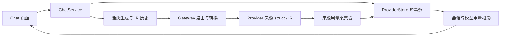

# 历史会话架构与实现

## 范围与默认选择

需求见 [文档 28](28-conversation-history-and-usage.md)。首版采用本地工作区共享历史；长期保存，用户可手动删除；流式正文在内存增量更新，结束时保存内容。重启将遗留生成中记录标为中断，不重新请求 Provider。媒体沿用已支持的内联数据或来源引用，过期资源和工具续传遵循既有规则。

## 架构

应用服务协调 Console 活跃会话与 Store；Gateway 记录实际调用和来源 Usage。轮次状态使用枚举，模型和设置使用独立快照。现有 ProtocolCodec、IR 历史兼容规则和数据库连接池继续复用。

- Core `conversation`：会话选择、有序内容和可序列化的共用历史类型。
- Store `chat_history`：公开的记录类型、短事务读写、分页、数据库并发控制、汇总。
- Console `chat_service`：创建、恢复、提交、完成及选择保存；`chat_sessions` 保留活跃生成和页面广播。
- Gateway `history`：内部请求关联、实际模型快照、来源用量采集和结束保存。
- Chat 页面：数据库历史列表、逐轮模型与用量、会话和模型汇总、删除。累计用量入口固定在标题栏，详情独立滚动；左侧设置默认折叠，协议与思考模式使用对齐的两列布局。

## 采用的设计方式

| 方式 | 项目落点 | 用途 |
| --- | --- | --- |
| 应用服务与仓储门面 | Console `ChatService`、现有 `ProviderStore` | 将页面操作、内存生成状态和数据库短事务分开，复用现有池和错误类型 |
| 显式状态机 | `Status` 和 `UsageState` | 生成状态与用量完整程度独立，迟到统计不改变正文终态 |
| 不可变业务快照 | `Selection`、`ActualCall` | 每轮固定模型和思考设置，配置变化不改写历史 |
| 来源观察器 | Gateway `Sink` | 复用整包 IR 与来源 SSE 解码状态，在转换之前采集累计用量 |
| 查询投影 | `Summary`、`Totals` | 依据已保存轮次汇总，合计、覆盖率与模型分组共用计算规则 |
| 幂等保存与重试缓冲 | 业务请求 ID、终态快照 | 保存失败后重试已有内容与统计，不重复调用 Provider |

## 存储

会话记录保存 ID、标题、选择、偏好和时间。轮次记录保存会话内顺序、输入和回复内容、选择快照、状态、请求关联、实际模型及 Usage。标题、输入、回复与错误使用现有主密钥加密并绑定记录 ID；查询指标保存可空数值列。JSON 是类型化结构的持久化格式，回复载荷有版本号；协议编解码仍使用现有 struct 与 IR。汇总目前在读取的轮次上计算，数值列保留独立查询口径。

轮次事务锁定对应会话；同一会话最多一个活跃轮次。模型选择与生成开始都校验活跃状态。Console 和 Gateway 分别更新内容与实际调用字段，避免后到保存覆盖已报告用量。相同请求重复结束保存保持幂等。Console 与 Gateway 共享 Store 的连接池；SQLite 历史写入先等待异步锁，再进入 IMMEDIATE 事务，避免同步锁等待阻塞持锁任务。PostgreSQL 使用会话行锁。

## 请求关联与统计

Console 创建跨重启唯一的随机业务请求 ID。内部请求还携带仅服务端持有的随机认证令牌，Gateway 验证后关联已有轮次；两种专用头在请求 Provider 前移除。遥测的进程内自增 ID 保持独立。

Gateway 来源采集器在同协议和跨协议路径均读取来源 struct／IR。JSON 读取来源响应的 Usage；SSE 使用来源解码器累计快照。正文处理中只更新内存，异步结束阶段保存。跨协议父子请求共用采集器，取消仍可取得已有用量；不通过 Drop 执行数据库操作。

实际调用快照包括 Provider ID／名称、上游模型、来源协议、返回模型和生效思考配置。输入、输出、cache、reasoning 的统计口径遵循文档 28。快照未完整时单独标识，缺失不补零。来源统计不依赖目标协议能否表达这些字段。

## 保存与恢复

1. 输入事务落库并占用活跃轮次，再开始 Provider 请求。
2. 生成期间广播展示快照；停止销毁 HTTP future，保留已收到文字和来源统计。
3. Gateway 保存调用结果；Console 保存内容终态。两者顺序无关，各自只更新自己的字段。
4. 页面查询权威统计；保存失败显示提示，回复与来源用量终态保留在共享内存中，用户可重试保存；重试不再次请求 Provider。未完成保存的来源用量显示待确认。
5. 恢复按轮次顺序重建 IR。正常结束和 Provider 明确报告的截断回复可进入下一轮；失败、取消与进程中断的部分回复只用于展示。刷新后停止控件读取服务端状态；已提交、尚未发送的输入也能直接取消。
6. 生成中刷新先返回 GET 页面快照，事件绑定完成后只恢复 HTTP POST shard 的增量订阅，不重发 Provider 请求。当前 Pingora 内嵌 Console 不依赖 WebSocket 升级。

## 运行边界

- 启动中断恢复针对单个本地运行服务；多服务共享历史时，需要另行加入生成任务的归属与租约。
- 结束前意外退出不会保存尚在内存的正文片段；保存失败的重试缓冲也只在当前进程存活期间有效。已成功保存的记录和用量可跨重启恢复。
- 媒体与工具引用沿用现有作用域和有效期；历史正文长期保存不延长外部资源有效期。
- 当前记录 Console Chat 发起的对话；普通外部代理请求继续走现有遥测。

## 任务

| 编号 | 内容 | 验收 | 状态 |
| --- | --- | --- | --- |
| H1 | 共用历史类型、双数据库表与迁移 | 旧库升级，类型化载荷往返 | 已完成 |
| H2 | Store 事务、分页、幂等、并发及统计 | 两数据库读写一致，缺失与零及加权汇总 | 已完成 |
| H3 | Console 应用服务与历史恢复 | 刷新／重启保留，继续跨协议对话 | 已完成 |
| H4 | Gateway 实际路由与来源用量记录 | 四同协议＋十二跨方向，两种响应模式 | 已完成 |
| H5 | 历史列表、逐轮统计与模型分组页面 | 保存状态、混用模型、历史删除 | 已完成 |
| H6 | 失败、停止、中断与配置失效 | 已报告消耗保留，错误不污染上下文 | 已完成 |
| H7 | 回归、数据库、HTTP 与浏览器验收 | 迁移、重启、统计与实际页面通过 | 已完成 |

仅在各项验证通过后标记完成；实现期间运行受影响测试，结束统一执行 workspace、Clippy、格式检查。

## 验收结果

2026-10-07：

- SQLite 与已配置的 PostgreSQL 测试库通过迁移、并发、幂等、加密、分页、停止和重启恢复验证；PostgreSQL 使用独立 schema 并清理，不改现有配置数据。
- 模拟 Provider 验证四种客户端 × 四种来源协议 × 两种响应模式，共 32 个组合。来源 cache 写入和完整 Usage 保存不受客户端协议表达能力影响；重启后继续发送有序 IR，删除配置后仍能查阅快照。
- 内部关联认证拒绝伪造请求；取消保留已有正文和部分来源计数；保存失败重试不再调用 Provider。
- 浏览器验证生成中刷新仍接收增量并可停止，同一历史切换 Chat→Gemini 路由后继续对话，刷新保留记录和实际模型分组。示例两轮输入 22、输出 3、总计 25、缓存读取 8，加权命中率 36.4%；缓存写入仅一轮报告，展示覆盖率 1/2，取消轮标为部分用量。
- 布局补充验收：长对话滚动不移动标题栏用量入口，生成结束更新累计值并保持详情展开；设置修改后保持展开，思考标签与下拉框水平对齐。用量详情支持关闭按钮、外部点击和 Escape；390×844 窄屏浮层完整显示，较长详情内部滚动。
- `cargo test --workspace --all-targets`：343 项通过，11 项需要真实环境或人工运行的既有用例忽略；此次未新增真实 Provider 调用。
- `cargo clippy --workspace --all-targets -- -D warnings`、`cargo fmt --all -- --check` 与 `git diff --check` 通过。
